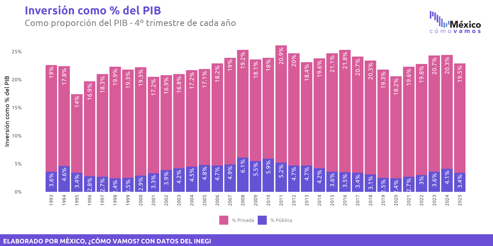

```{=html}
<style>
  h1, h2, h3 { color: #1e4c7d; }
  .callout-note { border-left: 5px solid #1e4c7d !important; }
  blockquote { border-left: 4px solid #1e4c7d; background: #f4f8fc; padding: .6em 1em; }
  pre code { font-size: 0.9em; }
</style>
```

::: {.callout-note title="Acerca de este documento"}
Este documento contiene las respuestas a los ejercicios propuestos para la preparación del examen práctico del curso **TC2001B.601 — Introducción a la Ciencia de Datos** (Ene-Jun 2026). Todas las bases de datos se leen directamente desde internet para garantizar reproducibilidad.
:::

# Preparación del entorno

Cargamos las librerías necesarias. Todas las llamadas a `library()` se concentran al inicio.

```{r setup}
library(tidyverse)   # Manipulación + visualización
library(scales)      # Formatos de números para las gráficas
library(plotly)      # Gráficas interactivas (Ejercicio 1)
library(ggpubr)      # ggbackground() para plantilla INEGI (Ejercicio 6)
library(knitr)       # Tablas con kable()
```

---

# Ejercicio 1 — Evolución de búsquedas de ChatGPT en México

::: {.callout-tip title="Enunciado"}
1. Elabore una gráfica de líneas en la cual pueda ver la evolución de las búsquedas en Google de ChatGPT en México. Los datos están en [este enlace](https://raw.githubusercontent.com/JuveCampos/TC2001B.601-Ciencia-de-datos-ene-jun-2026/refs/heads/main/05_EXAMENES/preparacion_examen_practico/chatgpt.csv). La columna `semana` muestra la fecha del domingo con el que inicia cada semana; `chat_gpt_mexico` es el índice de búsqueda (0 a 100).
2. Determine la semana en la cual se alcanzó el día con mayor búsquedas de ChatGPT.
3. ¿En qué fechas se alcanzan los mínimos locales y qué información aporta?
:::

## Carga de datos y gráfica base

```{r ej1-carga}
chatgpt <- read_csv("https://raw.githubusercontent.com/JuveCampos/TC2001B.601-Ciencia-de-datos-ene-jun-2026/refs/heads/main/05_EXAMENES/preparacion_examen_practico/chatgpt.csv") %>%
  filter(chat_gpt_mexico > 0) # Eliminamos los datos de cuando no existía ChatGPT

# Gráfica base de líneas con la evolución de las búsquedas
grafica_chatgpt <- chatgpt %>%
  ggplot(aes(x = semana, y = chat_gpt_mexico)) +
  geom_line(color = "#1e4c7d", linewidth = 0.7) +
  geom_point(color = "#1e4c7d", size = 0.8) +
  scale_x_date(date_breaks = "3 weeks", date_labels = "%Y-%m-%d") +
  labs(
    title    = "Evolución de búsquedas de ChatGPT en México",
    subtitle = "Índice de búsqueda semanal (0 = mínimo, 100 = máximo histórico)",
    x        = "Semana (fecha del domingo)",
    y        = "Índice de búsqueda",
    caption  = "Fuente: Google Trends"
  ) +
  theme_minimal() +
  theme(axis.text.x = element_text(angle = 90, hjust = 1, vjust = 0.5))

grafica_chatgpt
```

## Semana con el máximo de búsquedas

```{r ej1-max}
semana_max <- chatgpt %>%
  filter(chat_gpt_mexico == max(chat_gpt_mexico, na.rm = TRUE))

semana_max %>% kable()
```

> **Respuesta.** Las dos semanas en las que se alcanzó el valor máximo (100) fueron la del **28 de septiembre de 2025** y la del **19 de octubre de 2025**.

## Identificación de mínimos locales (gráfica interactiva)

```{r ej1-plotly}
#| fig-cap: "Pase el cursor sobre cada punto para ver su fecha y valor."
ggplotly(grafica_chatgpt)
```

> **Interpretación.** Al inspeccionar los mínimos locales en la gráfica interactiva se observa que los picos hacia abajo tienden a caer en semanas que coinciden con:
>
> - **Diciembre** (vacaciones de fin de año / Navidad).
> - **Semana Santa** (marzo-abril).
> - **Periodos vacacionales de verano** (julio).
>
> Esto sugiere que las búsquedas de ChatGPT están asociadas con actividad escolar y laboral: cuando la gente está de vacaciones, baja el interés.

---

# Ejercicio 2 — Crecimiento sexenal del PIB

::: {.callout-tip title="Enunciado"}
El archivo [`crecimiento_presidente.csv`](https://raw.githubusercontent.com/JuveCampos/TC2001B.601-Ciencia-de-datos-ene-jun-2026/refs/heads/main/05_EXAMENES/preparacion_examen_practico/crecimiento_presidente.csv) contiene la tasa de crecimiento acumulado para los primeros 23 trimestres de cada sexenio (hasta el 2024T2). Con estos datos, replique la gráfica original incluyendo todas las etiquetas y usando colores similares.
:::

```{r ej2}
#| fig-width: 10
#| fig-height: 6

crecimiento <- read_csv("https://raw.githubusercontent.com/JuveCampos/TC2001B.601-Ciencia-de-datos-ene-jun-2026/refs/heads/main/05_EXAMENES/preparacion_examen_practico/crecimiento_presidente.csv")

# Mapeo de colores de la paleta usada en la gráfica original
colores_presidente <- c(
  "verde oscuro" = "#2F4e43",
  "azul claro"   = "#97cce9",
  "café"         = "#98362e"
)

# Ordenamos a los presidentes en el orden cronológico (aparecen en el CSV)
crecimiento <- crecimiento %>%
  mutate(etiqueta = factor(etiqueta, levels = etiqueta))

# Replicamos la gráfica de barras
grafica_crecimiento <- crecimiento %>%
  ggplot(aes(x = etiqueta, y = crecimiento, fill = color)) +
  geom_col(width = 0.7) +
  geom_text(
    aes(label = paste0(crecimiento, "%")),
    vjust = -0.4, size = 4, fontface = "bold", family = "Ubuntu"
  ) +
  scale_fill_manual(values = colores_presidente, guide = "none") +
  scale_y_continuous(labels = scales::comma_format(suffix = "%"),
                     expand = expansion(mult = c(0, 0.1))) +
  labs(
    title    = "Crecimiento sexenal del PIB",
    subtitle = "Serie desestacionalizada y de tendencia ciclo.\nComparación primeros 23 trimestres de cada sexenio",
    x        = NULL,
    y        = NULL,
    caption  = "Elaborado por México, ¿Cómo vamos? con la serie desestacionalizada del PIB de INEGI"
  ) +
  theme_minimal(base_size = 12) +
  theme(
    plot.title    = element_text(face = "bold", size = 20, color = "#6552d3"),
    plot.subtitle = element_text(color = "gray50"),
    panel.grid.major = element_blank(),
    axis.text.x   = element_text(face = "bold"),
    axis.line.x = element_line(),
    text = element_text(family = "Ubuntu")
  )

grafica_crecimiento
```

> **Interpretación.** El sexenio de **CSG** tuvo el mayor crecimiento acumulado en los primeros 23 trimestres (24.8%), seguido por **EZPDL** (20.6%). Los sexenios más recientes (FCH, EPN y AMLO) tuvieron crecimientos considerablemente menores, siendo **AMLO** el de menor crecimiento acumulado (4.5%).

---

# Ejercicio 3 — Métricas por vendedor

::: {.callout-tip title="Enunciado"}
Con los datos de [`ventas_tienda.csv`](https://raw.githubusercontent.com/JuveCampos/TC2001B.601-Ciencia-de-datos-ene-jun-2026/refs/heads/main/02_EJERCICIOS_PRACTICOS/Sesion%2002/archivos%20carga/Data/ventas_tienda.csv):

1. Calcula por vendedor: número de transacciones, ingreso total e ingreso promedio por transacción.
2. Construye un gráfico de barras ordenado por ingreso total (`reorder()` dentro del `aes()`).
3. Añade `geom_text()` con etiqueta en formato numérico con separador de miles (`prettyNum(x, big.mark = ",")`).
4. Aplica `theme_minimal`, título y caption con la fuente.
:::

## Cálculo de métricas

```{r ej3-metricas}
ventas <- read_csv("https://raw.githubusercontent.com/JuveCampos/TC2001B.601-Ciencia-de-datos-ene-jun-2026/refs/heads/main/02_EJERCICIOS_PRACTICOS/Sesion%2002/archivos%20carga/Data/ventas_tienda.csv")

metricas_vendedor <- ventas %>%
  group_by(vendedor) %>%
  summarise(
    n_transacciones = n(), # Número de renglones
    ingreso_total   = sum(cantidad * precio_unitario, na.rm = TRUE),
    ingreso_prom    = ingreso_total / n_transacciones
  ) %>%
  arrange(desc(ingreso_total))

metricas_vendedor %>% kable(digits = 2)
```

## Gráfico de barras

```{r ej3-grafica}
grafica_vendedores <- metricas_vendedor %>%
  ggplot(aes(x = reorder(vendedor, -ingreso_total), y = ingreso_total)) +
  geom_col(fill = "#1e4c7d") +
  geom_text(
    aes(label = prettyNum(round(ingreso_total), big.mark = ",")),
    vjust = -0.4, size = 4
  ) +
  scale_y_continuous(
    labels = label_number(big.mark = ","),
    expand = expansion(mult = c(0, 0.12))
  ) +
  labs(
    title   = "Ingreso total por vendedor",
    x       = "Vendedor",
    y       = "Ingreso total",
    caption = "Fuente: Registros internos de ventas"
  ) +
  theme_minimal()

grafica_vendedores
```

---

# Ejercicio 4 — Conversión de Celsius a Fahrenheit

::: {.callout-tip title="Enunciado"}
Fórmula: $°F = \left(\frac{9}{5} \cdot °C\right) + 32$.

1. Genere una función propia que le permita realizar la transformación.
2. Obtenga a cuántos grados Fahrenheit equivalen 40 °C.
:::

```{r ej4}
# (1) Función de conversión
celsius_a_fahrenheit <- function(celsius) {
  ((9 / 5) * celsius) + 32
}

# (2) Conversión de 40 °C
resultado_f <- celsius_a_fahrenheit(40)
print(str_c("40 °C equivalen a ", resultado_f, " °F"))
```

> **Respuesta.** 40 grados Celsius equivalen a **104 °F** (calorcito).

---

# Ejercicio 5 — Tiempo de traslado

::: {.callout-tip title="Enunciado"}
Encuesta de 40 trabajadores en CDMX con el tiempo de traslado en minutos. Datos en [`tiempo_traslado.csv`](https://raw.githubusercontent.com/JuveCampos/TC2001B.601-Ciencia-de-datos-ene-jun-2026/refs/heads/main/05_EXAMENES/preparacion_examen_practico/tiempo_traslado.csv).

1. Cargar los datos.
2. Calcular media, mediana, mínimo y máximo (con `na.rm = TRUE`).
3. Identificar y manejar los NAs.
4. Detectar outliers con el método IQR: reportar Q1, Q3, IQR, límites e IDs.
5. Generar un boxplot.
:::

## Carga y estadísticas descriptivas

```{r ej5-stats}
traslado <- read_csv("https://raw.githubusercontent.com/JuveCampos/TC2001B.601-Ciencia-de-datos-ene-jun-2026/refs/heads/main/05_EXAMENES/preparacion_examen_practico/tiempo_traslado.csv")

estadisticas_traslado <- traslado %>%
  summarise(
    media   = mean(minutos, na.rm = TRUE),
    mediana = median(minutos, na.rm = TRUE),
    minimo  = min(minutos, na.rm = TRUE),
    maximo  = max(minutos, na.rm = TRUE)
  )

estadisticas_traslado %>% kable(digits = 2)

# También se puede calcular por fuera con las funciones clásicas
media_traslado   <- mean(traslado$minutos,   na.rm = TRUE)
mediana_traslado <- median(traslado$minutos, na.rm = TRUE)
min_traslado     <- min(traslado$minutos,    na.rm = TRUE)
max_traslado     <- max(traslado$minutos,    na.rm = TRUE)
```

> **Observación.** El máximo (150 min) es mucho más grande que la media/mediana (~35–40 min), lo que sugiere la presencia de al menos un outlier alto. El mínimo (3 min) también parece muy pequeño para un traslado en CDMX (otro atípico, pero por abajo).

## Manejo de NAs

```{r ej5-nas}
n_nas <- traslado %>%
  summarise(na_minutos = sum(is.na(minutos))) %>%
  pull(na_minutos)

print(paste0("Número de NAs en la columna minutos: ", n_nas))

# Eliminamos los NAs para los cálculos posteriores (conservando IDs)
traslado_limpio <- traslado %>%
  filter(!is.na(minutos))
```

## Detección de outliers con IQR

```{r ej5-iqr}
q1   <- quantile(traslado_limpio$minutos, 0.25)
q3   <- quantile(traslado_limpio$minutos, 0.75)
iqr  <- q3 - q1
lim_inf <- q1 - 1.5 * iqr
lim_sup <- q3 + 1.5 * iqr

print(paste0("Q1 = ", q1, " | Q3 = ", q3, " | IQR = ", iqr))
print(paste0("Límite inferior = ", lim_inf,
             " | Límite superior = ", lim_sup))

# Identificamos los IDs outliers (| representa "o" lógico)
outliers <- traslado_limpio %>%
  filter(minutos < lim_inf | minutos > lim_sup)

outliers %>% kable()

# Alternativa con between() negado
outliers <- traslado_limpio %>%
  filter(!between(minutos, lim_inf, lim_sup))

outliers %>% kable()
```

> **Respuesta.** Los outliers son las observaciones cuyo valor cae fuera de $[Q_1 - 1.5 \cdot IQR,\; Q_3 + 1.5 \cdot IQR]$. Los IDs correspondientes aparecen en la tabla anterior. Estos registros podrían ser errores de captura o casos genuinos extremos que merecen análisis aparte.

## Boxplot

```{r ej5-boxplot}
#| fig-width: 5
#| fig-height: 6
traslado_limpio %>%
  ggplot(aes(y = minutos)) +
  geom_boxplot(fill = "#1e4c7d", alpha = 0.7, outlier.color = "red") +
  labs(
    title   = "Tiempo de traslado al trabajo (minutos)",
    y       = "Minutos",
    caption = "Fuente: Encuesta a 40 trabajadores en CDMX"
  ) +
  theme_minimal() +
  theme(axis.text.x = element_blank(), axis.ticks.x = element_blank())
```

---

# Ejercicio 6 — Inversión pública y privada como % del PIB

::: {.callout-tip title="Enunciado"}
El archivo [`porcentaje_inversion_pib_4T.csv`](https://raw.githubusercontent.com/JuveCampos/TC2001B.601-Ciencia-de-datos-ene-jun-2026/refs/heads/main/05_EXAMENES/preparacion_examen_practico/porcentaje_inversion_pib_4T.csv) tiene los porcentajes de inversión pública y privada con respecto al PIB (datos INEGI). Replique la gráfica original usando la plantilla INEGI como fondo.
:::

## Construcción de la gráfica

```{r ej6-grafica}
#| fig-width: 12
#| fig-height: 6

inversion <- read_csv("https://raw.githubusercontent.com/JuveCampos/TC2001B.601-Ciencia-de-datos-ene-jun-2026/refs/heads/main/05_EXAMENES/preparacion_examen_practico/porcentaje_inversion_pib_4T.csv")

# Pasamos a formato largo (tidy) para poder graficar con ggplot
inversion_long <- inversion %>%
  select(anio, `% Privada`, `% Pública`) %>%
  pivot_longer(
    cols      = c(`% Pública`, `% Privada`),
    names_to  = "tipo",
    values_to = "porcentaje"
  ) %>%
  mutate(
    tipo = factor(
      tipo,
      levels = c("% Privada", "% Pública"),
      labels = c("% Privada", "% Pública")
    )
  )

# Replicamos la gráfica con los colores de MCV
grafica_inversion <- inversion_long %>%
  ggplot(aes(x = anio, y = porcentaje, fill = tipo)) +
  geom_col() +
  geom_text(aes(label = str_c(porcentaje, "%")),
            color = "white", angle = 90,
            hjust = 1.1,
            position = position_stack(),
            family = "Ubuntu") +
  scale_fill_manual(values = c(
    "% Privada" = "#d75b99",
    "% Pública" = "#6552d4"
  )) +
  scale_x_continuous(breaks = 1993:2025) +
  scale_y_continuous(breaks = seq(0, 30, 5),
                     expand = expansion(c(0, 0.1)),
                     labels = scales::comma_format(suffix = "%")) +
  labs(
    title    = "Inversión como % del PIB",
    subtitle = "Como proporción del PIB - 4º trimestre de cada año",
    x        = NULL,
    y        = "Inversión como % del PIB",
    fill     = NULL,
    caption  = NULL
  ) +
  theme_minimal() +
  theme(
    legend.position = "bottom",
    plot.title      = element_text(face = "bold", color = "#6552d4", size = 20),
    plot.subtitle   = element_text(color = "gray50", size = 16),
    legend.text     = element_text(color = "gray50"),
    text            = element_text(family = "Ubuntu"),
    axis.text.x     = element_text(angle = 90, hjust = 1, vjust = 0.5),
    panel.grid.minor = element_blank(),
    plot.margin     = margin(t = 0.4, r = 0.4, b = 1.2, l = 0.4, unit = "cm"),
    panel.grid.major = element_blank()
  )

grafica_inversion
```

## Gráfica sobre la plantilla INEGI

A continuación mostramos la versión final de la gráfica con la plantilla PDF de INEGI como fondo, usando `ggpubr::ggbackground()`:

```{r ej6-plantilla-codigo}
#| eval: false
# Guardamos con plantilla en la carpeta
plt_impresion <- ggbackground(
  gg = grafica_inversion,
  background = "../preparacion_examen_practico/01_inegi.pdf"
)

ggsave(filename = "grafica_inversion.png",
       plot = plt_impresion, device = "png",
       height = 6, width = 12)
```

{fig-alt="Gráfica de barras apiladas mostrando la inversión pública y privada como porcentaje del PIB con la plantilla INEGI de fondo."}

---

# Ejercicio 7 — Rutas de entrega (Cuarteto de Anscombe)

::: {.callout-tip title="Enunciado"}
Una empresa de logística tiene 4 rutas de entrega. Para cada ruta se registraron 11 observaciones con `km` y `tiempo`. Datos: [`rutas_entrega.csv`](https://raw.githubusercontent.com/JuveCampos/TC2001B.601-Ciencia-de-datos-ene-jun-2026/refs/heads/main/05_EXAMENES/nuevos_ejercicios_propuestos/rutas_entrega.csv).

a. Calcula por ruta: media y desviación estándar de `km` y `tiempo`, y la correlación entre ambas. ¿Qué observas?
b. Gráfico de dispersión `km` vs `tiempo` por ruta (`facet_wrap`) con línea de regresión en cada panel.
c. Párrafo sobre la importancia de la visualización.
:::

## (a) Estadísticas descriptivas por ruta

```{r ej7-stats}
rutas <- read_csv("https://raw.githubusercontent.com/JuveCampos/TC2001B.601-Ciencia-de-datos-ene-jun-2026/refs/heads/main/05_EXAMENES/nuevos_ejercicios_propuestos/rutas_entrega.csv")

tabla_rutas <- rutas %>%
  group_by(ruta) %>%
  summarise(
    media_km      = mean(km),
    media_tiempo  = mean(tiempo),
    sd_km         = sd(km),
    sd_tiempo     = sd(tiempo),
    correlacion   = cor(km, tiempo)
  )

tabla_rutas %>% kable(digits = 3)
```

> **Observación.** ¡Las medias, desviaciones estándar y correlaciones son prácticamente idénticas entre las 4 rutas! Este dataset corresponde al **cuarteto de Anscombe** (Anscombe, 1973): cuatro conjuntos de datos con estadísticas descriptivas casi iguales pero estructuras muy distintas. **Lección:** las estadísticas descriptivas nunca sustituyen a la visualización.

## (b) Gráfico de dispersión por ruta

```{r ej7-grafica}
#| fig-width: 9
#| fig-height: 7
grafica_rutas <- rutas %>%
  ggplot(aes(x = km, y = tiempo)) +
  geom_point(color = "#1e4c7d", size = 2) +
  geom_smooth(method = "lm", se = FALSE, color = "#C8102E") +
  facet_wrap(~ ruta) +
  labs(
    title    = "Relación entre kilómetros recorridos y tiempo de entrega",
    subtitle = "4 rutas de una empresa de logística (11 observaciones c/u)",
    x        = "Kilómetros",
    y        = "Tiempo (minutos)",
    caption  = "Fuente: Registros internos de la empresa"
  ) +
  theme_minimal()

grafica_rutas
```

## (c) Importancia de la visualización

> La visualización es crucial porque, aun cuando las cuatro rutas presentan estadísticas descriptivas (media, desviación estándar y correlación) prácticamente idénticas, la gráfica de dispersión revela que cada una tiene un patrón muy diferente: una muestra una relación lineal limpia, otra una curvatura, otra una línea con un outlier y otra un caso donde un solo punto extremo conduce toda la correlación. Si nos quedamos solo con los números, tomaríamos decisiones erróneas —por ejemplo, asumir que todas las rutas se comportan igual—. La gráfica nos permite ver la estructura real de los datos, detectar outliers y validar supuestos antes de ajustar modelos de regresión.

---

# Ejercicio 8 — Dataset de salud

::: {.callout-tip title="Enunciado"}
Dataset de 200 pacientes ([`salud.csv`](https://raw.githubusercontent.com/JuveCampos/TC2001B.601-Ciencia-de-datos-ene-jun-2026/refs/heads/main/05_EXAMENES/nuevos_ejercicios_propuestos/salud.csv)) con: `edad`, `peso_kg`, `altura_cm`, `presion_sistolica`, `colesterol`, `horas_ejercicio_sem`, `glucosa`.

1. IDs con altura outlier (método IQR).
2. Promedio de `presion_sistolica`, `colesterol`, `horas_ejercicio_sem` y `glucosa` por grupo de edad: jóvenes (≤29), adultos (30-60), mayores (61+).
3. Gráfica de barras para cada variable, con el orden jóvenes → adultos → mayores.
4. Dispersión `presion_sistolica` vs `edad` + correlación e interpretación.
:::

## (1) Outliers de altura

```{r ej8-outliers}
salud <- read_csv("https://raw.githubusercontent.com/JuveCampos/TC2001B.601-Ciencia-de-datos-ene-jun-2026/refs/heads/main/05_EXAMENES/nuevos_ejercicios_propuestos/salud.csv")

q1_alt   <- quantile(salud$altura_cm, 0.25, na.rm = TRUE)
q3_alt   <- quantile(salud$altura_cm, 0.75, na.rm = TRUE)
iqr_alt  <- q3_alt - q1_alt
lim_inf_alt <- q1_alt - 1.5 * iqr_alt
lim_sup_alt <- q3_alt + 1.5 * iqr_alt

outliers_altura <- salud %>%
  filter(altura_cm < lim_inf_alt | altura_cm > lim_sup_alt) %>%
  select(paciente_id, altura_cm)

print(paste0("Q1=", q1_alt, " | Q3=", q3_alt, " | IQR=", iqr_alt))
print(paste0("Límites de altura: [", lim_inf_alt, ", ", lim_sup_alt, "]"))
outliers_altura %>% kable()
```

> **Respuesta.** Los IDs en la tabla `outliers_altura` corresponden a las personas cuya altura cae fuera del rango $[Q_1 - 1.5 \cdot IQR,\; Q_3 + 1.5 \cdot IQR]$.

## (2) Promedios por grupo de edad

```{r ej8-grupos}
salud_grupos <- salud %>%
  mutate(
    grupo_edad = case_when(
      edad <= 29 ~ "Jóvenes (<=29)",
      edad <= 60 ~ "Adultos (30-60)",
      TRUE       ~ "Mayores (61+)"
    ),
    # Aseguramos el orden: jóvenes, adultos, mayores
    grupo_edad = factor(
      grupo_edad,
      levels = c("Jóvenes (<=29)", "Adultos (30-60)", "Mayores (61+)")
    )
  )

promedios_grupo <- salud_grupos %>%
  group_by(grupo_edad) %>%
  summarise(
    presion_sistolica  = mean(presion_sistolica, na.rm = TRUE),
    colesterol         = mean(colesterol, na.rm = TRUE),
    horas_ejercicio    = mean(horas_ejercicio_sem, na.rm = TRUE),
    glucosa            = mean(glucosa, na.rm = TRUE)
  )

promedios_grupo %>% kable(digits = 2)
```

## (3) Gráficas de barras por variable (facetas)

```{r ej8-barras}
#| fig-width: 10
#| fig-height: 7
# Pasamos a formato largo para poder facetar
promedios_largo <- promedios_grupo %>%
  pivot_longer(
    cols      = -grupo_edad,
    names_to  = "variable",
    values_to = "promedio"
  ) %>%
  mutate(
    variable = recode(variable,
      presion_sistolica = "Presión sistólica",
      colesterol        = "Colesterol",
      horas_ejercicio   = "Horas ejercicio/sem",
      glucosa           = "Glucosa"
    )
  )

promedios_largo %>%
  ggplot(aes(x = grupo_edad, y = promedio, fill = grupo_edad)) +
  geom_col() +
  geom_text(aes(label = round(promedio, 1)),
            vjust = -0.4, size = 3.5) +
  facet_wrap(~ variable, scales = "free_y") +
  scale_fill_manual(values = c("#4FC3F7", "#1e4c7d", "#C8102E"),
                    guide = "none") +
  labs(
    title   = "Promedios de variables de salud por grupo de edad",
    x       = NULL,
    y       = "Promedio",
    caption = "Fuente: Dataset salud.csv (200 pacientes)"
  ) +
  theme_minimal() +
  theme(axis.text.x = element_text(angle = 20, hjust = 1))
```

## (4) Presión sistólica vs edad

```{r ej8-dispersion}
correlacion_pe <- cor(salud$presion_sistolica, salud$edad,
                      use = "complete.obs")

print(paste0("Correlación presión sistólica ~ edad: ",
             round(correlacion_pe, 3)))

salud %>%
  ggplot(aes(x = edad, y = presion_sistolica)) +
  geom_point(color = "#1e4c7d", alpha = 0.6) +
  geom_smooth(method = "lm", se = TRUE, color = "#C8102E") +
  labs(
    title    = "Relación entre edad y presión sistólica",
    subtitle = paste0("Correlación de Pearson r = ",
                      round(correlacion_pe, 3)),
    x        = "Edad (años)",
    y        = "Presión sistólica (mmHg)",
    caption  = "Fuente: Dataset salud.csv"
  ) +
  theme_minimal()
```

> **Interpretación.** La correlación es **positiva y relativamente alta**, lo que tiene sentido clínicamente: la presión sistólica tiende a aumentar con la edad. La gráfica de dispersión confirma este patrón —nube de puntos claramente ascendente y recta de regresión con pendiente positiva—, consistente con la literatura biomédica: el endurecimiento arterial progresivo con la edad eleva la presión sistólica.

---

# Sesión

```{r sesion}
sessionInfo()
```
